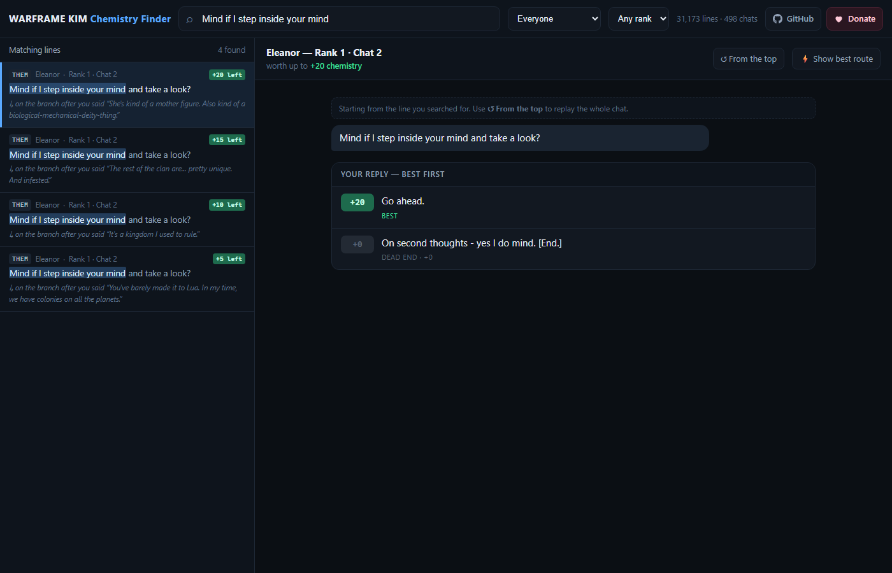

# WARFRAME KIM Chemistry Finder

**Paste a line your Hex crush just sent you. Instantly see every reply you can give, ranked by how much Chemistry each one is actually worth.**

No install, no account, no internet needed. One HTML file — double-click it and it opens in your browser.

---

## The problem this solves

KIM conversations branch. A lot. Existing dialogue browsers show you the whole tree at once and leave you to
scroll through hundreds of nodes hunting for the one message currently on your screen — and even when you find it,
nothing tells you which reply is the good one.

This flips it around. You **search for the line you were just sent**, and it drops you at that exact
point in the tree with your options already scored.

## What the numbers mean

Every reply gets a badge:

| Badge | Meaning |
|---|---|
| **+20** | The Chemistry still reachable down that branch if you keep replying well |
| **best** | The highest-scoring reply available right now |
| **best (tied)** | Genuinely no difference — pick whichever fits your character |
| **dead end · +0** | Ends the chat early and banks nothing (usually the `[End.]` replies) |
| **−10 vs best** | This reply costs you 10 Chemistry compared to the top option |

## Why the numbers are trustworthy

They are not community estimates, vibes, or guesswork.

Warframe ships its KIM conversations as **dialogue graphs**, and those graphs contain explicit
Chemistry award nodes with exact values baked in. This tool reads those graphs directly and, for every
single line of dialogue, solves backwards to find the maximum Chemistry still reachable between that
point and the end of the conversation.

So when it says a reply is worth +20, that number came out of the game's own files.

Where the conversation branches on something **you** control, the score is the best you can do.
Where it branches on **stored state** — a flag set in an earlier chat — the outcome isn't yours to pick,
so a `min` value is shown alongside and the app labels which branch it assumed.

## How to use it

1. **[Download `index.html`](../../raw/main/index.html)** *(right-click → Save link as…)*
2. Double-click it. It opens in your browser.
3. Paste or type a few words from the message currently on your KIM screen.
4. Pick the matching result from the left panel.
5. Your reply options appear, best first. Click one to continue through the conversation.

### Tips

- Press <kbd>/</kbd> anywhere to jump back to the search box.
- **⚡ Show best route** plays the optimal path straight through to the end.
- **↺ From the top** replays the whole conversation from its first message.
- Filter by character or Chemistry rank using the dropdowns.
- You can also ignore search entirely and browse all 498 conversations from the left panel.

### Watch out for repeated lines

Some characters say the *exact same sentence* in several different branches. Eleanor's
"Mind if I step inside your mind and take a look?" appears **four times**, on branches worth
**+20, +15, +10 and +5**.

Search results show each one's value badge and the reply that leads to it
(*"on the branch after you said 'The Lotus.'"*), so you can tell them apart. That distinction alone
is a 15-Chemistry swing.

## Good to know

- Covers all 14 chat contacts, 498 conversations, 31,173 lines of dialogue.
- **Chemistry from gifts and Bounties is not included** — this is chat replies only.
- Warframe never *reduces* Chemistry for a worse reply. A low-scoring pick costs you potential
  gain, not progress you already earned.
- Works offline, and on Windows, macOS, Linux, Android and iOS — anything with a browser.
- The data snapshot date is shown on the app's welcome screen.

## Support

If this saved you some time, [a tip is always appreciated](https://paypal.me/ITgamer). Entirely optional.

## Credits

Dialogue data sourced from [browse.wf](https://browse.wf), which extracts it from Warframe's own game files.

Warframe and all associated dialogue, characters and content are the property of
**Digital Extremes Ltd.** This is an unofficial fan-made tool and is not affiliated with or endorsed
by Digital Extremes.
